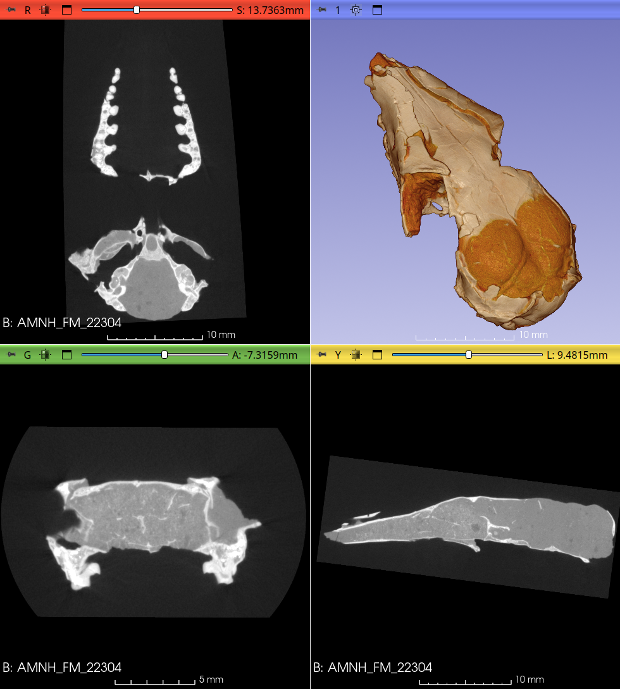
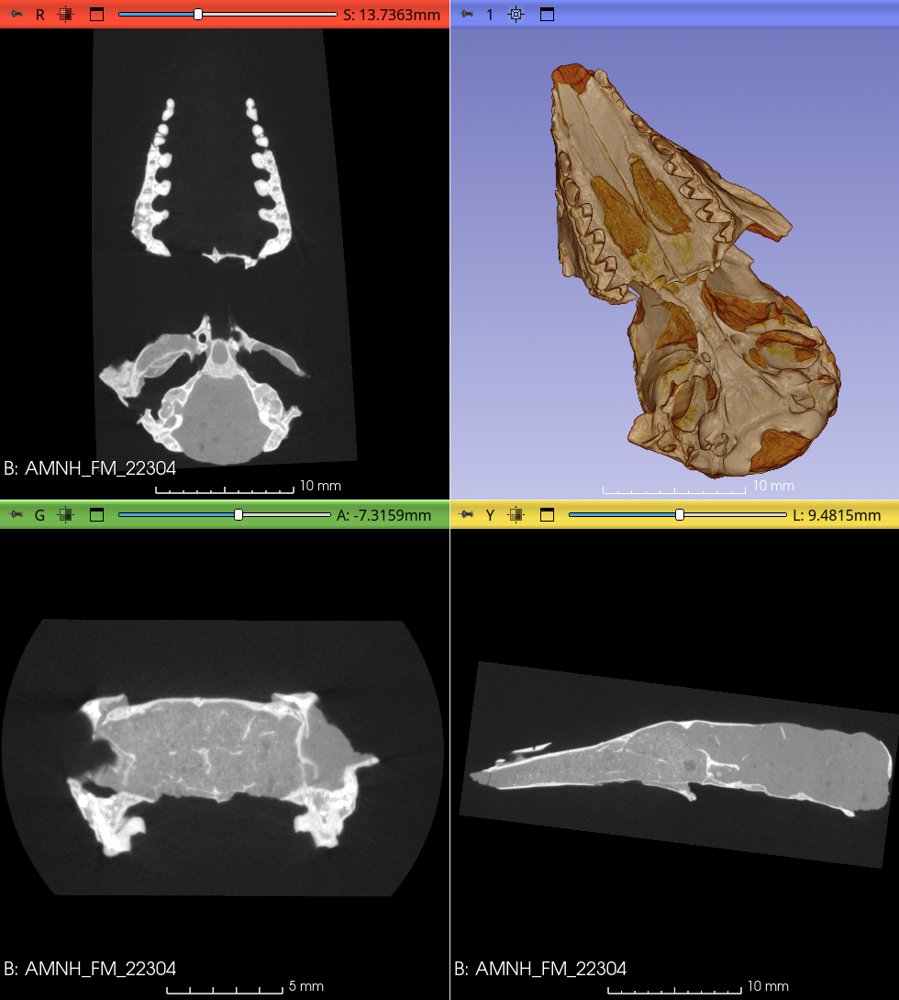
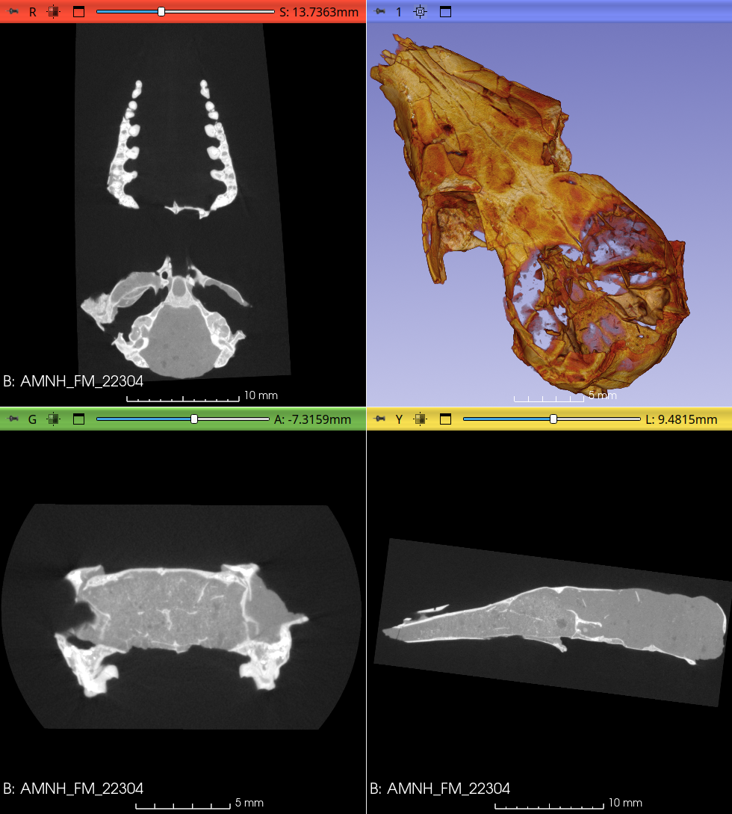

## MorphoDepot Repository
Repository for segmentation of a specimen scan.  See [this JSON file](MorphoDepotAccession.json) for specimen details.
* Species: Herpetotherium fugax
* Modality: Micro CT (or synchrotron)
* Contrast: No
* Dimensions: (1166, 1990, 865)
* Spacing (mm): (0.0185547, 0.0185547, 0.0185547)

## Screenshots

_Oblique dorsal_

_Oblique ventral_

_Without matrix_

## About the specimen
Skull of _Peratherium sp._ from AMNH fossil mammal collections (AMNH-FM-22304). Collected from Chadronian/Orellan; 2.5 mi SE of Jim Christian Hills, Lusk area, Niabrara Co., WY; coll. by Morris Skinner & Bob Emry (1960).

## About the scan
Specimen scanned by Matthew Colbert 24 September 2006 at The University of Texas at Austin Department of Geological Sciences for Murat Maga. 

Original Scan parameters were: 1024x1024 16-bit TIFF images.  II, 190 kV, 0.11 mA, no filter, air wedge, no offset, slice thickness (2 lines = 0.04064 mm), S.O.D. 58 mm, 1400 views, 2 samples per view, inter-slice spacing (2 lines = 0.04064 mm), field of reconstruction 19 mm (maximum field of view 19.29594 mm), reconstruction offset 5000, scanner scale 1350, reconstruction scale 400.  Acquired with 19 slices per rotation, with 15 slices per set. Drift and ring-removal processing done by Alison Mote based on correction of raw sinogram data using IDL routines “RK_SinoDeDrift” and “RK_SinoRingProcSimul,” both with default parameters. Images are reoriented in 3D Slicer to conform anatomical directions and resampled for 0.018 micron isotropic resolution by Murat Maga.
